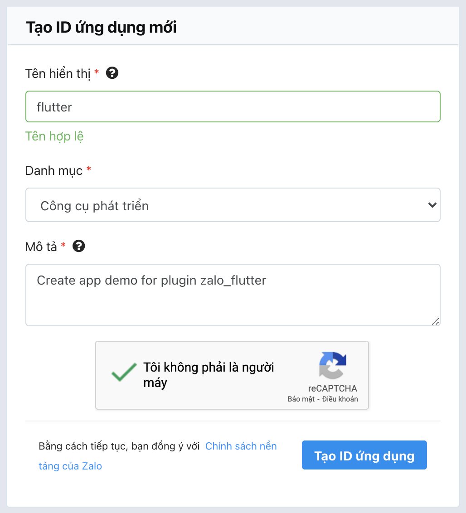
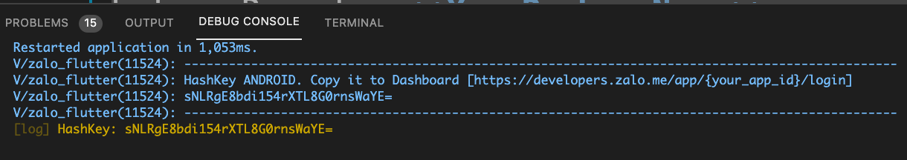
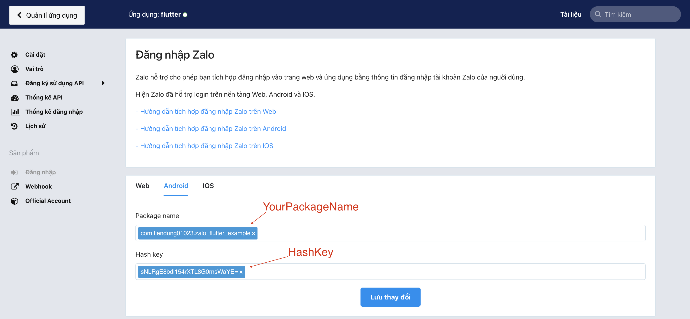
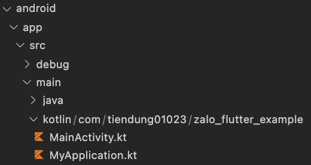
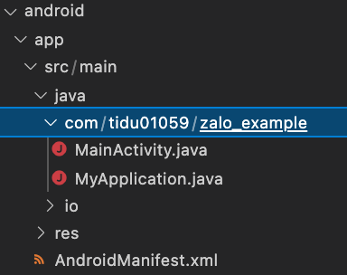
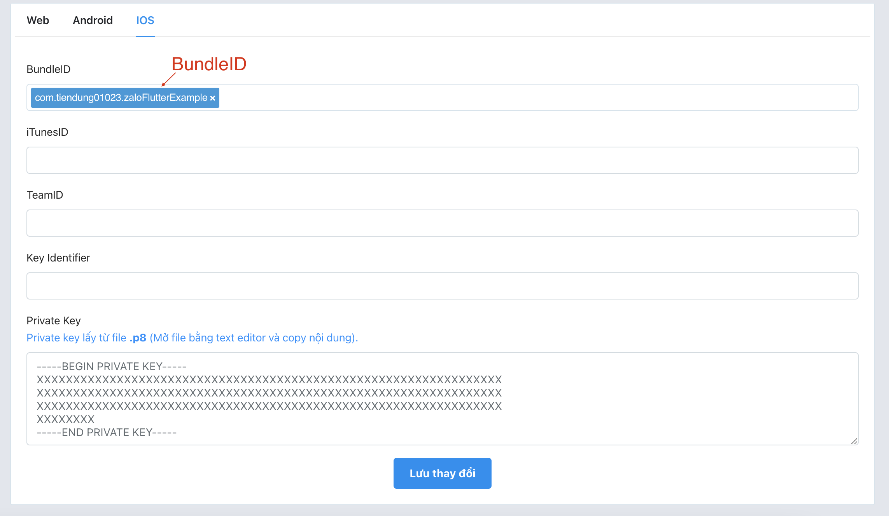

<!-- [](https://pub.dev/packages/zalo_flutter) -->

A Flutter plugin for [Zalo APIs](https://developers.zalo.me/docs).

_Note_: This plugin is still under development, and some APIs might not be
available yet. [Feedback](https://github.com/tiendung01023/zalo_flutter/issues) and
[Pull Requests](https://github.com/tiendung01023/zalo_flutter/pulls) are most welcome!

## 1. Setup

### 1.1 Create app Zalo

To access Zalo APIs, you'll need to make sure to [create your application](https://developers.zalo.me/createapp).


### 1.2 Get ZaloAppID

Then, you access to Dashboard (https://developers.zalo.me/app/[ZaloAppID]/settings). Remember your **ZaloAppID**


### 1.3 Import the package

To use this plugin, follow the [plugin installation instructions](https://pub.dev/packages/zalo_flutter/install).

### 1.4 Android integration

1. Open `android/app/build.gradle` and edit

```gradle
minSdkVersion 18 // or bigger
```

2. Open to `/android/app/src/main/AndroidManifest.xml` and edit

```xml
<application
    ...
    android:name=".MyApplication">
    <activity
        ...
        android:name=".MainActivity">
        ...
    </activity>

    ...

    <!-- ZaloFlutter start -->
    <meta-data
        android:name="com.zing.zalo.zalosdk.appID"
        android:value="@string/zalo_flutter_app_id" />
    <activity
        android:name="com.zing.zalo.zalosdk.oauth.BrowserLoginActivity"
        android:exported="true">
        <intent-filter>
            <action android:name="android.intent.action.VIEW"/>
            <category android:name="android.intent.category.DEFAULT"/>
            <category android:name="android.intent.category.BROWSABLE"/>
            <data android:scheme="@string/zalo_flutter_app_id_protocol"/>
        </intent-filter>
    </activity>
    <!-- ZaloFlutter end -->
</application>
<queries>
    <package android:name="com.zing.zalo" />
</queries>
```

**Note:** 
- With app target Android 11 (API >=30), add this info for open Zalo app
```xml
<queries>
    <package android:name="com.zing.zalo">
</queries>
```
- With app target Android 12 (API >=31), add `android:exported="true"` for get callback when login with Browser

3. Create file `strings.xml`(if not exists) on folder `/android/app/src/main/res/values/strings.xml`. Replace with your ZaloAppID

```xml
<resources>
    <string name="zalo_flutter_app_id">[ZaloAppID]</string>
    <string name="zalo_flutter_app_id_protocol">zalo-[ZaloAppID]</string>
</resources>
```

4. Open file `main.dart` and add this function to get HashKey

```dart
  @override
  void initState() {
    super.initState();
    _initZaloFlutter(); // Add this line
  }

  // Add this function
  Future<void> _initZaloFlutter() async {
    if (Platform.isAndroid) {
      final hashKey = await ZaloFlutter.getHashKeyAndroid();
      log('HashKey: $hashKey');
    }
  }
```
Then, you see Debug console and copy **HashKey**


5. Open Zalo Dashboard => Login => Android (https://developers.zalo.me/app/[ZaloAppID]/login)

Paste **HashKey** and **YourPackageName** to this page and press **Save**



6. Add proguard for zaloSDK
```
-keep class com.zing.zalo.**{ *; }
-keep enum com.zing.zalo.**{ *; }
-keep interface com.zing.zalo.**{ *; }
```

#### Continue with Kotlin


- Edit the file `MainActivity.kt` as below. Remember **YourPackageName**

```kotlin
package [YourPackageName]

import android.content.Intent
import io.flutter.embedding.android.FlutterActivity
import com.zing.zalo.zalosdk.oauth.ZaloSDK // <-- Add this line

class MainActivity: FlutterActivity() {
    override fun onActivityResult(requestCode:Int, resultCode:Int, data: Intent) {
        super.onActivityResult(requestCode, resultCode, data)
        ZaloSDK.Instance.onActivityResult(this, requestCode, resultCode, data) // <-- Add this line
    }
}
```

- Create file `MyApplication.kt` in same folder of `MainActivity.kt`. Replace with your **YourPackageName**

```kotlin
package [YourPackageName]

import io.flutter.app.FlutterApplication
import io.flutter.plugin.common.PluginRegistry
import com.zing.zalo.zalosdk.oauth.ZaloSDKApplication

class MyApplication : FlutterApplication(), PluginRegistry.PluginRegistrantCallback {
    override fun onCreate() {
        super.onCreate()
        ZaloSDKApplication.wrap(this)
    }
    override fun registerWith(registry: PluginRegistry) {}
}
```

#### Continue with Java


- Edit the file `MainActivity.java` as below. Remember **YourPackageName**

```java
package [YourPackageName];

import androidx.annotation.NonNull;
import io.flutter.embedding.android.FlutterActivity;
import io.flutter.embedding.engine.FlutterEngine;
import io.flutter.plugins.GeneratedPluginRegistrant;

import android.content.Intent;
import com.zing.zalo.zalosdk.oauth.ZaloSDK; // Add this line

public class MainActivity extends FlutterActivity {
    @Override
    protected void onActivityResult(int requestCode, int resultCode, Intent data) {
        super.onActivityResult(requestCode, resultCode, data);
        ZaloSDK.Instance.onActivityResult(this, requestCode, resultCode, data); // Add this line
    }
}
```

- Create file `MyApplication.java` in same folder of `MainActivity.java`. Replace with your **YourPackageName**

```kotlin
package [YourPackageName]

import android.app.Application;

import com.zing.zalo.zalosdk.oauth.ZaloSDKApplication;

public class MyApplication extends Application {
    @Override
    public void onCreate() {
        super.onCreate();
        ZaloSDKApplication.wrap(this);
    }
}
```

### iOS integration

1. Open `ios/Runner/Info.plist` file, edit and replace with your **ZaloAppID**

```xml
<?xml version="1.0" encoding="UTF-8"?>
<!DOCTYPE plist PUBLIC "-//Apple//DTD PLIST 1.0//EN" "http://www.apple.com/DTDs/PropertyList-1.0.dtd">
<plist version="1.0">
<dict>
	...

	<!-- ZaloFlutter start-->
	<key>CFBundleURLTypes</key>
	<array>
		<dict>
			<key>CFBundleTypeRole</key>
			<string>Editor</string>
			<key>CFBundleURLName</key>
			<string>zalo</string>
			<key>CFBundleURLSchemes</key>
			<array>
				<string>zalo-[ZaloAppID]</string>
			</array>
		</dict>
	</array>
	<key>ZaloAppID</key>
	<string>[ZaloAppID]</string>
	<key>LSApplicationQueriesSchemes</key>
	<array>
		<string>zalosdk</string>
		<string>zaloshareext</string>
	</array>
      <!-- ZaloFlutter end-->
</dict>
</plist>
```

2. Open `ios/Runner/AppDelegate.swift` file, add the following Zalo function code
```swift
import UIKit
import Flutter
import ZaloSDK

@UIApplicationMain
@objc class AppDelegate: FlutterAppDelegate {
    override func application(
        _ application: UIApplication,
        didFinishLaunchingWithOptions launchOptions: [UIApplication.LaunchOptionsKey: Any]?
    ) -> Bool {
        GeneratedPluginRegistrant.register(with: self)
        return super.application(application, didFinishLaunchingWithOptions: launchOptions)
    }
    // Zalo function go here
    override func application(_ app: UIApplication, open url: URL, options: [UIApplication.OpenURLOptionsKey : Any] = [:]) -> Bool {
        return ZDKApplicationDelegate.sharedInstance().application(app, open: url, options: options)
    }
}
```

3. Open `ios/Runner.xcodeproj/project.pbxproj`, search `PRODUCT_BUNDLE_IDENTIFIER` and copy your **BundleID**


4. Open Zalo Dashboard => Login => IOS (https://developers.zalo.me/app/[ZaloAppID]/login)
Paste **BundleID** to this page and press **Save**



## Usage

Add the following import to your Dart code:

```dart
import 'package:zalo_flutter/zalo_flutter.dart';
```

Functions:

- Get HashKey Android for register app in dashboard Zalo

```dart
String? data = await ZaloFlutter.getHashKeyAndroid();
```

- Authenticate (with app or webview)

```dart
ZaloLogin data = await ZaloFlutter.login(
    refreshToken: refreshToken,
);
```

- Log out - SDK clear oauth code in cache

```dart
await ZaloFlutter.logout();
```

- Validate refresh token

```dart
bool data = await ZaloFlutter.validateRefreshToken(
    refreshToken: refreshToken,
);
```

- Get Zalo user profile
```dart
ZaloProfile data = await ZaloFlutter.getUserProfile(
    accessToken: accessToken,
);
```

## Author
**Pham Tien Dung**

If you have any questions, feel free to message me right away

**Gmail:** tiendung01023@gmail.com

**Github:** https://github.com/tiendung01023
